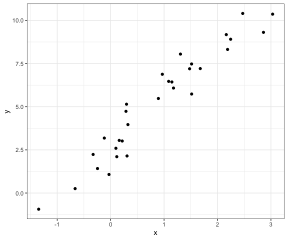

Simulation
================
Derek Lamb
2023-11-02

``` r
library(tidyverse)
library(rvest)

# Set default figure options
knitr::opts_chunk$set(
  fig.width = 6,
  out.width = "90%"
)

theme_set(theme_bw() + theme(legend.position = "bottom"))

options(
  ggplot2.continuous.colour = "viridis",
  ggplot2.continuous.fill = "viridis"
)

scale_colour_discrete = scale_colour_viridis_d
scale_fill_discrete = scale_fill_viridis_d

# set seed for consistency
set.seed(12345)
```

# Revisit `sim_mean_sd`

``` r
sim_mean_sd = function(n_obs, mu = 5, sigma = 1){

  x_vec = rnorm(n = n_obs, mean = mu, sd = sigma)

  tibble(
    mean = mean(x_vec),
    sd = sd(x_vec)
  )
  
}
```

``` r
sim_mean_sd(n_obs = 30)
```

    ## # A tibble: 1 × 2
    ##    mean    sd
    ##   <dbl> <dbl>
    ## 1  5.08 0.938

Let’s iterate to see how this works UNDER REPEATED SAMPLING!!!

``` r
output = vector("list", length = 100)
for (i in 1:100){
  output[[i]] = sim_mean_sd(n_obs = 30)
}

sim_results = bind_rows(output)

sim_results |> 
  ggplot(aes(x = mean)) + 
  geom_density()
```


``` r
sim_results |> 
  summarize(
    mu_hat = mean(mean),
    sd_xbar = sd(mean)
  )
```

    ## # A tibble: 1 × 2
    ##   mu_hat sd_xbar
    ##    <dbl>   <dbl>
    ## 1   5.00   0.180

Use a map function

``` r
df_sim = 
  expand_grid(
    sample_size = c(30,60,120,240),
    iter = 1:1000
  ) |> 
  mutate(df_estimate = map(sample_size, sim_mean_sd)) |> 
  unnest(df_estimate) 

df_sim |> 
  mutate(sample_size = str_c("n = ", sample_size),
         sample_size = fct_inorder(sample_size)) |> 
  ggplot(aes(x = sample_size, y = mean, fill = sample_size)) + 
  geom_boxplot(alpha = 0.4)
```


Could easily change function to `rbinom()`

## Regression!

Model is $Y = \beta_0 + \beta_1X_i + \epsilon_i$. Goal is to estimate
$\hat{\beta_0}$ and $\hat{\beta_1}$.

``` r
beta_0 = 2
beta_1 = 3

sim_data =
  tibble(
    x = rnorm(n = 30, mean = 1, sd = 1),
    y = beta_0 + beta_1 * x + rnorm(n = 30, mean = 0, sd = 1)
  )

ls_fit = lm(y ~ x, data = sim_data)
ls_fit
```

    ## 
    ## Call:
    ## lm(formula = y ~ x, data = sim_data)
    ## 
    ## Coefficients:
    ## (Intercept)            x  
    ##       2.780        2.763

``` r
sim_data |> 
  ggplot(aes(x = x, y = y)) + geom_point()
```



Do this with a function!

``` r
sim_slr = function(n_obs, beta_0 = 2, beta_1 = 3){
  sim_data =
    tibble(
      x = rnorm(n = n_obs, mean = 1, sd = 1),
      y = beta_0 + beta_1 * x + rnorm(n = n_obs, mean = 0, sd = 1)
    )
  
  ls_fit = lm(y ~ x, data = sim_data)
  
  tibble(
    beta_0_hat = coef(ls_fit)[1],
    beta_1_hat = coef(ls_fit)[2]
  )
}
```

Run this a bunch

``` r
df_sim = 
  expand_grid(
    sample_size = 30,
    iter = 1:1000
  ) |> 
  mutate(df_estimate = map(sample_size, sim_slr)) |> 
  unnest(df_estimate)
```

``` r
df_sim |> 
  summarize(
    mean_b0_hat = mean(beta_0_hat),
    mean_b1_hat = mean(beta_1_hat)
  )
```

    ## # A tibble: 1 × 2
    ##   mean_b0_hat mean_b1_hat
    ##         <dbl>       <dbl>
    ## 1        1.99        3.01

``` r
df_sim |> 
  ggplot(aes(x = beta_0_hat)) +
  geom_histogram()
```

    ## `stat_bin()` using `bins = 30`. Pick better value with `binwidth`.


``` r
df_sim |> 
  ggplot(aes(x = beta_0_hat, y = beta_1_hat)) +
  geom_point()
```


