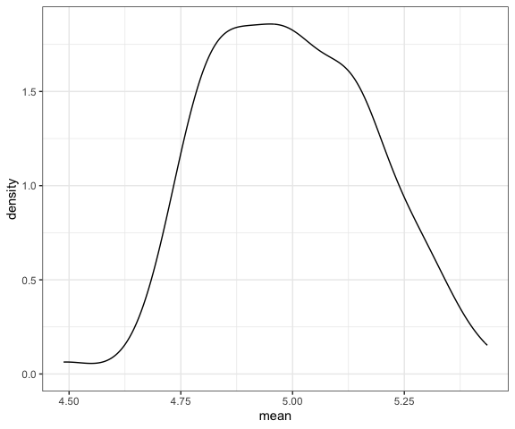
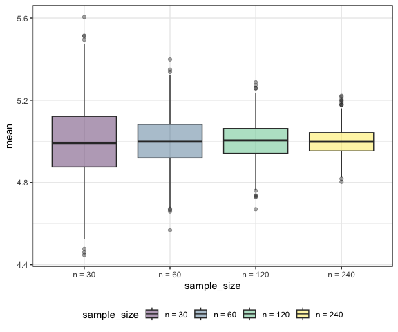

Simulation
================
Derek Lamb
2023-11-02

``` r
library(tidyverse)
library(rvest)

# Set default figure options
knitr::opts_chunk$set(
  fig.width = 6,
  out.width = "90%"
)

theme_set(theme_bw() + theme(legend.position = "bottom"))

options(
  ggplot2.continuous.colour = "viridis",
  ggplot2.continuous.fill = "viridis"
)

scale_colour_discrete = scale_colour_viridis_d
scale_fill_discrete = scale_fill_viridis_d

# set seed for consistency
set.seed(12345)
```

# Revisit `sim_mean_sd`

``` r
sim_mean_sd = function(n_obs, true_p = 0.9){

  x_vec = rbinom(n = n_obs, size = 1, prob = true_p)

  tibble(
    mean = mean(x_vec),
    sd = sd(x_vec)
  )
  
}
```

``` r
sim_mean_sd(n_obs = 30)
```

    ## # A tibble: 1 × 2
    ##    mean    sd
    ##   <dbl> <dbl>
    ## 1   0.9 0.305

Let’s iterate to see how this works UNDER REPEATED SAMPLING!!!

``` r
output = vector("list", length = 100)
for (i in 1:100){
  output[[i]] = sim_mean_sd(n_obs = 30)
}

sim_results = bind_rows(output)

sim_results |> 
  ggplot(aes(x = mean)) + 
  geom_density()
```



``` r
sim_results |> 
  summarize(
    mu_hat = mean(mean),
    sd_xbar = sd(mean)
  )
```

    ## # A tibble: 1 × 2
    ##   mu_hat sd_xbar
    ##    <dbl>   <dbl>
    ## 1  0.903  0.0518

Use a map function

``` r
df_sim = 
  expand_grid(
    sample_size = c(30,60,120,240),
    iter = 1:1000
  ) |> 
  mutate(df_estimate = map(sample_size, sim_mean_sd)) |> 
  unnest(df_estimate) 

df_sim |> 
  mutate(sample_size = str_c("n = ", sample_size),
         sample_size = fct_inorder(sample_size)) |> 
  ggplot(aes(x = sample_size, y = mean, fill = sample_size)) + 
  geom_boxplot(alpha = 0.4)
```


